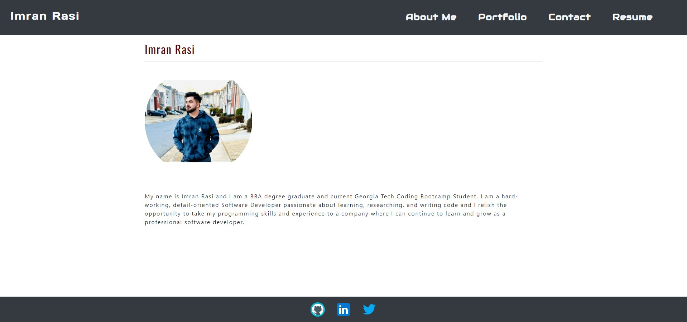
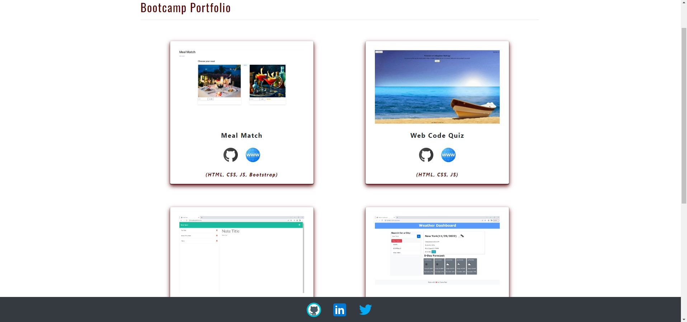
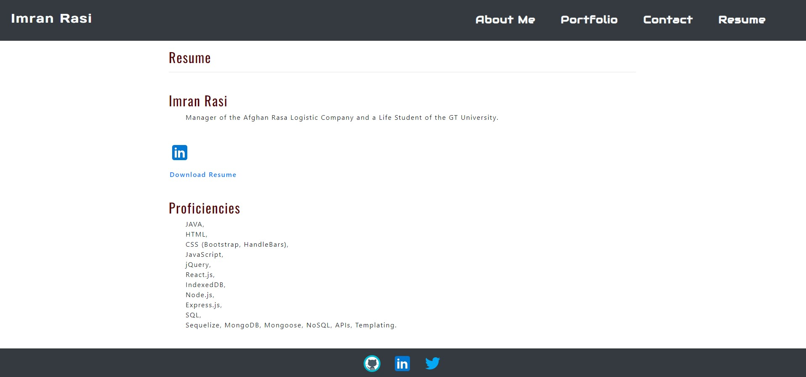

# Imrans-React-Portfolio

## Description

A simple SPA Portfolio template for developer/designers built with React. Use it to showcase your work, testimonials and other information to clients.

This is the link to the [App]()

## Table of Contents
* [Installation](#installation)
* [Demo](#demo)
* [Usage](#usage)
* [License](#license)
* [Credits](#credits)
* [Questions](#questions)

## Installation

You can open the [App](https://blooming-thicket-32337.herokuapp.com/)

## Demo

* You also can go through that link for a better look <a href="https://drive.google.com/file/d/1dCZZ9mnskBs4Y8FNng2e01TuQSryRjAO/view">Video</a>

## Usage 

To use this app go to the [Link](https://blooming-thicket-32337.herokuapp.com/).

## License

[MIT License](./LICENSE)

## Credits

## Questions

If you have any Questions :
  * Email : imran.rassi.2020@gmail.com
  * GitHub: [imran7rassi](https://github.com/imran7rassi)
